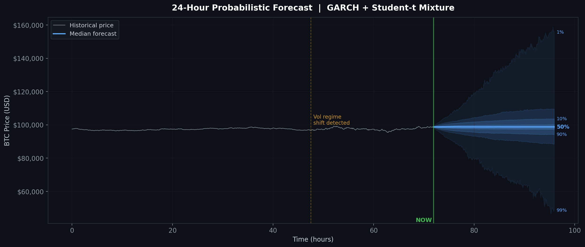
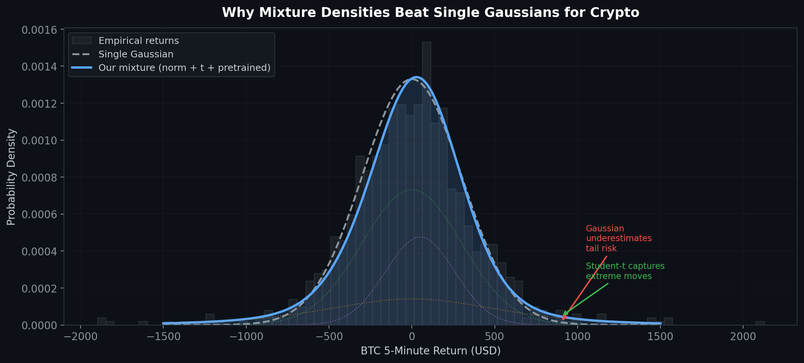
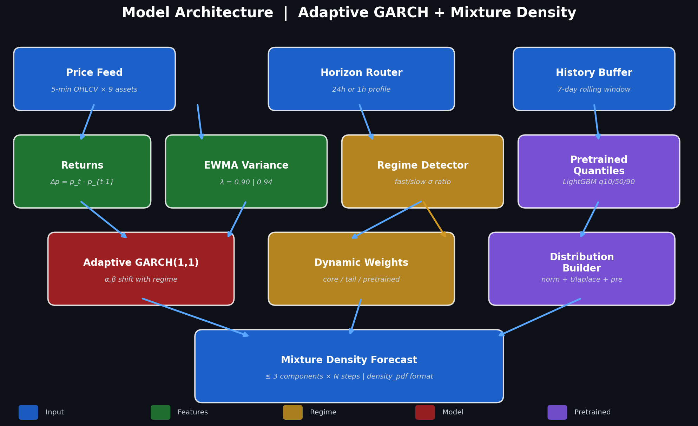
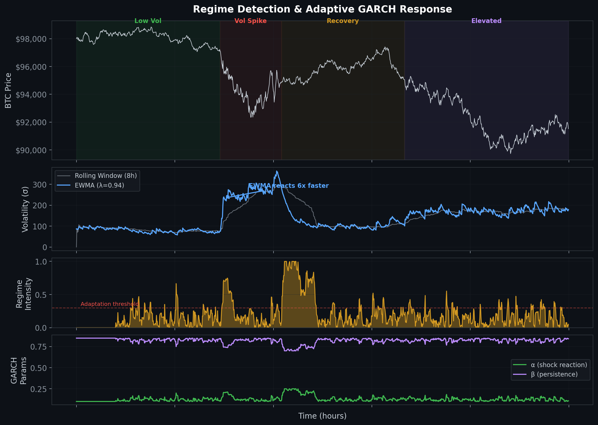
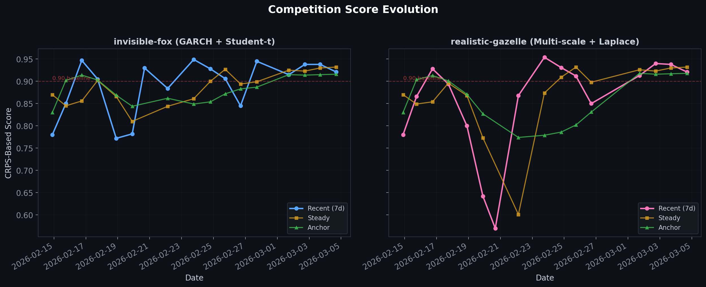

# Real-Time Probabilistic Crypto Forecasting

**Regime-adaptive GARCH mixture-density models for the [CrunchDAO Synth](https://hub.crunchdao.com/competitions/synth) competition** — predicting full probability distributions of price returns for 9 crypto & tokenized stock assets across multiple time horizons, scored live via CRPS.

<p align="center">
  
</p>

---

## The Challenge

The Synth competition requires participants to output **calibrated probability density functions** — not point predictions — for incremental price returns r(t,k) = P(t) - P(t-k) on a rolling basis. Predictions are scored using the **Continuous Ranked Probability Score (CRPS)**, which penalizes both miscalibrated uncertainty *and* location error.

| Constraint | Details |
|:--|:--|
| **Assets** | BTC, ETH, SOL, XAUT, SPYX, NVDAX, TSLAX, AAPLX, GOOGLX |
| **Horizons** | 24h (triggered hourly) · 1h (triggered every 12 min) |
| **Step resolutions** | 1 min → 5 min → 15 min → 1h → 6h → 24h |
| **Output format** | `density_pdf` mixture specification, ≤ 3 leaf components |
| **Latency budget** | All 9 assets × all steps in < 40 seconds |
| **Scoring** | 7-day rolling CRPS, normalized relative to field |

---

## Approach

### Why Not Just Fit a Gaussian?

<p align="center">
  
</p>

Crypto returns are **fat-tailed**, **heteroskedastic**, and exhibit **volatility clustering**. A single Gaussian dramatically underestimates tail risk and fails to adapt when market regimes change. Our approach uses **adaptive mixture densities** that widen their tails and shift their weights in real time.

### System Architecture

<p align="center">
  
</p>

### Two Competing Models (A/B Tested Live)

We run two models simultaneously on the live leaderboard to A/B test design choices:

| Component | **invisible-fox** | **realistic-gazelle** |
|:--|:--|:--|
| Core distribution | Normal | Normal |
| Tail distribution | **Student-t** (df adapts 3–5) | **Laplace** (scale adapts with regime) |
| Regime detection | 2-scale (1h / 8h windows) | 3-scale (1.5h / 4h / 12h windows) |
| EWMA λ (24h / 1h) | 0.94 / 0.90 | 0.97 / 0.93 |
| Pretrained component | LightGBM quantile models | LightGBM quantile models |
| Weight strategy | More aggressive tail shift | Consistency-tuned (wider Laplace base) |

### Key Technical Decisions

**1. Exponentially Weighted Moving Average (EWMA) Variance**

Traditional rolling-window variance has a lag of `window/2` bars. EWMA with λ=0.94 gives an effective memory of ~17 bars but reacts **~6x faster** to regime changes — critical when BTC volatility can triple in minutes.

**2. Adaptive GARCH(1,1)**

Standard GARCH uses fixed α (shock reaction) and β (persistence). We make both **regime-dependent**: during detected regime changes, α increases from ~0.10 to ~0.25 and β decreases, allowing the model to rapidly absorb new volatility levels.

**3. Horizon-Aware Tuning**

The 1h forecast profile operates at 1-minute resolution where 5-minute pretrained features are unreliable. We use separate parameter sets:
- **Shorter lookback** (6–8h vs 25h) for faster adaptation
- **Reduced pretrained weight** (10–15% vs 20–30%)
- **Heavier tail components** to absorb 1-minute noise
- **Fractional GARCH** stepping for sub-resolution intervals

**4. Multi-Step GARCH Evolution**

Rather than scaling variance by √t, we evolve GARCH forward step-by-step, correctly capturing variance mean-reversion and producing realistic confidence intervals that widen then stabilize.

---

## Regime Detection

<p align="center">
  
</p>

The regime detector compares short-window vs long-window volatility. When they diverge (fast σ ≫ slow σ), a **regime intensity** score drives real-time adaptation of:
- GARCH α/β parameters (faster shock absorption)
- Component weights (more tail, less pretrained)
- Volatility clamps (wider bounds during transitions)

---

## Results

<p align="center">
  
</p>

Scores improved steadily through iterative A/B testing:

| Milestone | Change | Impact |
|:--|:--|:--|
| v11–14 | Baseline GARCH + mixture components | Established ~0.85–0.90 range |
| v15/v19 | Regime-adaptive EWMA + adaptive GARCH | Reduced score decay by 5x |
| v16/v21 | Horizon-aware 1h tuning | Targeted 1h rank improvement |

Both models consistently score above the 0.90 baseline, with recent scores of **0.921** and steady scores of **0.932**.

---

## Project Structure

```
synth_synthetic_price_data/
├── synth-invisible-fox/          # Model A: GARCH + Student-t
│   ├── main.py                   #   Adaptive tracker (369 lines)
│   ├── resources/                #   Pretrained LightGBM quantile models
│   └── requirements.txt
├── synth-realistic-gazelle/      # Model B: Multi-scale + Laplace
│   ├── main.py                   #   Adaptive tracker (363 lines)
│   ├── resources/                #   Pretrained LightGBM quantile models
│   └── requirements.txt
├── test_regime.py                # Smoke tests (component count, weight sums, GARCH evolution)
├── bench_timing.py               # Latency benchmark (must complete in <40s)
├── track_ab_scores.py            # CLI for daily A/B score tracking
├── ab_score_log.csv              # Competition score history
├── generate_visualizations.py    # Generates all plots in docs/images/
└── docs/images/                  # README visualizations
```

---

## Quickstart

```bash
# Clone
git clone https://github.com/AndrewFSee/synth_synthetic_price_data.git
cd synth_synthetic_price_data

# Setup
python -m venv .venv
.venv/Scripts/activate      # Windows
pip install -r requirements.txt

# Run smoke tests
python test_regime.py

# Run timing benchmark
python bench_timing.py

# Generate visualizations
python generate_visualizations.py
```

---

## Technical Stack

- **Python 3.13** — core runtime
- **NumPy / SciPy** — numerical computation, distribution functions
- **LightGBM** — pretrained quantile regression models (offline-trained, loaded at runtime)
- **CrunchDAO crunch-cli / crunch-synth** — competition framework, `TrackerBase` interface
- **matplotlib** — visualization generation
- **density_pdf** — probabilistic forecast specification format

---

## License

MIT
